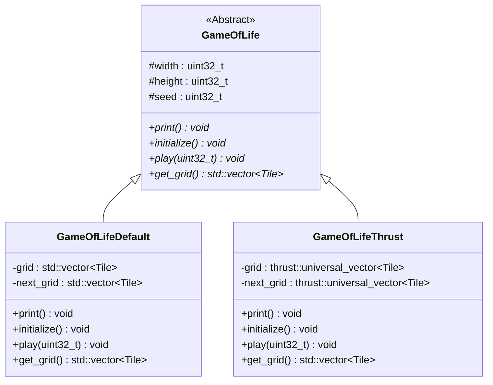

# Game Of Life (CUDA)

A few simple implementations of Conway's Game of Life [1], mostly using CUDA. This repository is in progress and will be augmented/improved soon to add more implementations.

The build has only been tested on windows using MSVC, but it shouldn't be that hard to set it up on other platforms, as well.

To build:

* set VCPKG_ROOT=...  # Your VCPKG root here
* cmake --preset configure
* cmake --build --preset build --config Release

To test:
* ctest -C Release --preset test

[1] https://en.wikipedia.org/wiki/Conway's_Game_of_Life

